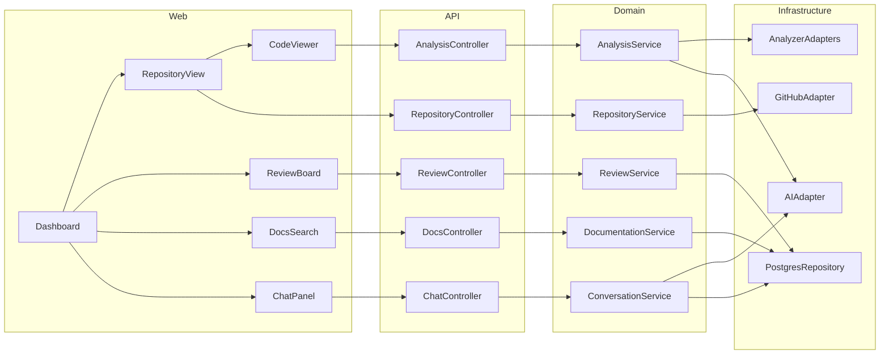

# Component Map

```mermaid
flowchart LR
  subgraph Web
    Dashboard
    RepositoryView
    CodeViewer
    ReviewBoard
    DocsSearch
    ChatPanel
  end
  subgraph API
    RepositoryController
    AnalysisController
    ReviewController
    DocsController
    ChatController
  end
  subgraph Domain
    RepositoryService
    AnalysisService
    ReviewService
    DocumentationService
    ConversationService
  end
  subgraph Infrastructure
    GitHubAdapter
    AIAdapter
    PostgresRepository
    AnalyzerAdapters
  end
  Dashboard --> RepositoryView
  Dashboard --> ReviewBoard
  Dashboard --> DocsSearch
  Dashboard --> ChatPanel
  RepositoryView --> CodeViewer
  RepositoryView --> RepositoryController
  CodeViewer --> AnalysisController
  ReviewBoard --> ReviewController
  DocsSearch --> DocsController
  ChatPanel --> ChatController
  RepositoryController --> RepositoryService
  AnalysisController --> AnalysisService
  ReviewController --> ReviewService
  DocsController --> DocumentationService
  ChatController --> ConversationService
  RepositoryService --> GitHubAdapter
  AnalysisService --> AnalyzerAdapters
  AnalysisService --> AIAdapter
  ReviewService --> PostgresRepository
  DocumentationService --> PostgresRepository
  ConversationService --> AIAdapter
  ConversationService --> PostgresRepository
```
