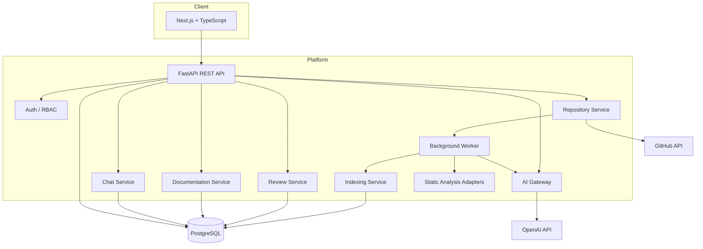

# Container Architecture

```mermaid
flowchart TB
  subgraph Client
    UI[Next.js + TypeScript]
  end
  subgraph Platform
    API[FastAPI REST API]
    Auth[Auth / RBAC]
    Repo[Repository Service]
    Index[Indexing Service]
    Review[Review Service]
    Docs[Documentation Service]
    Chat[Chat Service]
    AIGW[AI Gateway]
    Worker[Background Worker]
    Analyzer[Static Analysis Adapters]
  end
  DB[(PostgreSQL)]
  GH[GitHub API]
  OAI[OpenAI API]
  UI --> API
  API --> Auth
  API --> Repo
  API --> Review
  API --> Docs
  API --> Chat
  Repo --> GH
  Repo --> Worker
  Worker --> Index
  Worker --> Analyzer
  Index --> DB
  Review --> DB
  Docs --> DB
  Chat --> DB
  API --> DB
  API --> AIGW
  Worker --> AIGW
  AIGW --> OAI
```

### Boundary rule
The browser never calls GitHub or OpenAI directly. All credentials and policy enforcement remain server-side.
