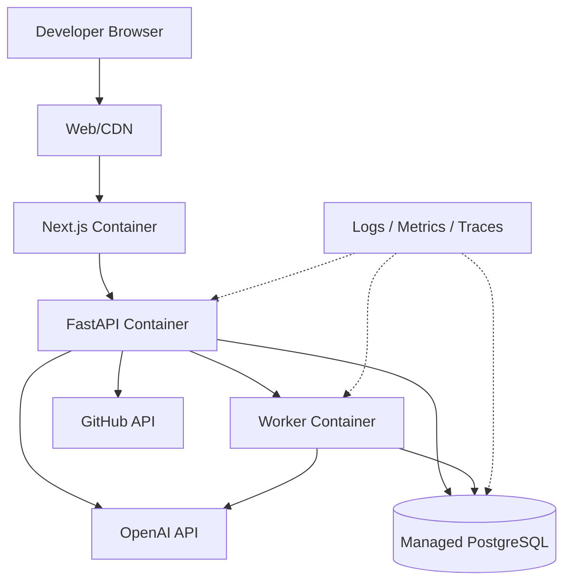

# Deployment Architecture

## Production considerations
- Separate public web and private API/network boundaries where possible.
- Use managed secrets rather than `.env` files in production.
- Use a queue for worker jobs when scaling beyond a single worker.
- Add object storage for repository archives if required.
- Add vector search through PostgreSQL extensions or a dedicated vector store when retrieval volume requires it.
- Add structured logs, request IDs, AI-run IDs and latency/token metrics.
