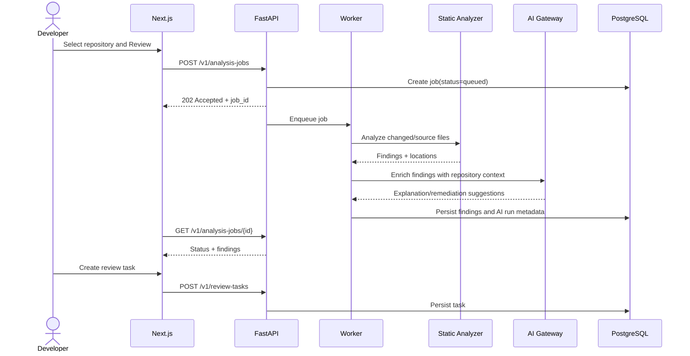

# Code Review Sequence

```mermaid
sequenceDiagram
  actor Dev as Developer
  participant UI as Next.js
  participant API as FastAPI
  participant W as Worker
  participant SA as Static Analyzer
  participant AI as AI Gateway
  participant DB as PostgreSQL

  Dev->>UI: Select repository and Review
  UI->>API: POST /v1/analysis-jobs
  API->>DB: Create job(status=queued)
  API-->>UI: 202 Accepted + job_id
  API->>W: Enqueue job
  W->>SA: Analyze changed/source files
  SA-->>W: Findings + locations
  W->>AI: Enrich findings with repository context
  AI-->>W: Explanation/remediation suggestions
  W->>DB: Persist findings and AI run metadata
  UI->>API: GET /v1/analysis-jobs/{id}
  API-->>UI: Status + findings
  Dev->>UI: Create review task
  UI->>API: POST /v1/review-tasks
  API->>DB: Persist task
```
