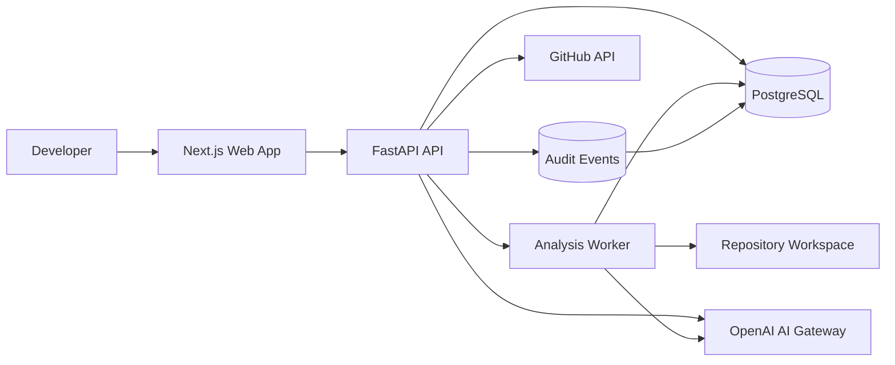

# System Context

## Main relationships
- Developer uses the web application.
- Web application communicates with the versioned API.
- API owns authentication, authorization, orchestration and persistence.
- Worker performs long-running indexing and analysis jobs.
- GitHub adapter imports repository metadata/content through controlled permissions.
- AI gateway centralizes model calls, prompts, retries, token limits and safety policy.
- PostgreSQL stores users, repositories, files, chunks, jobs, findings, review tasks, conversations and audit events.
